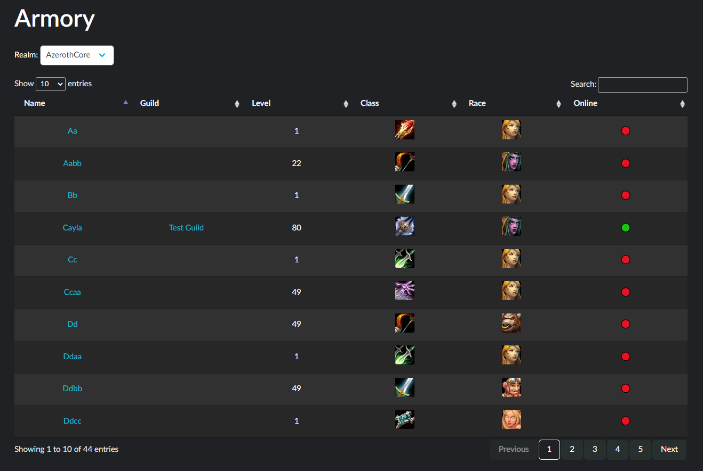
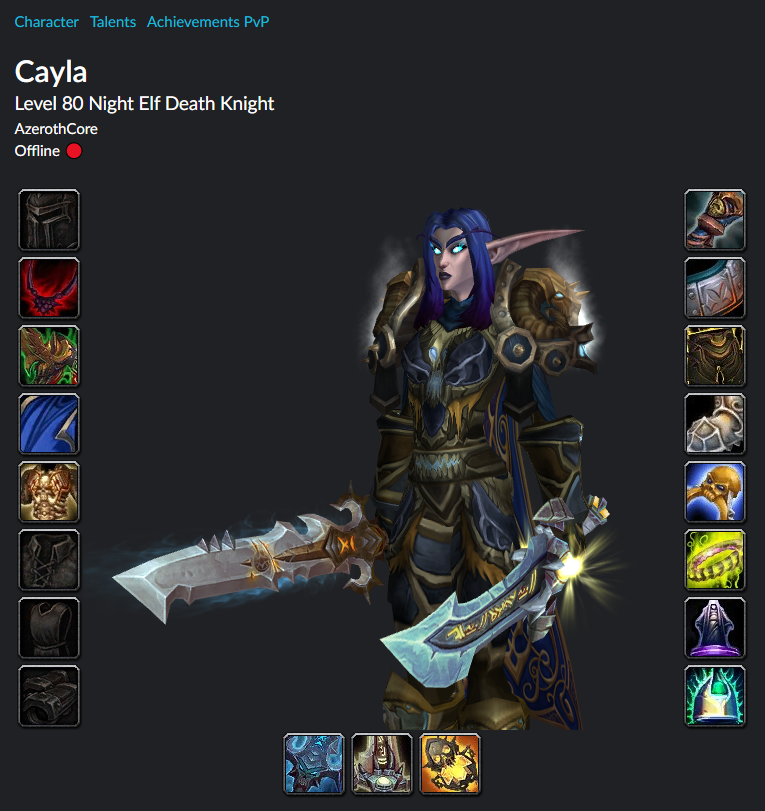
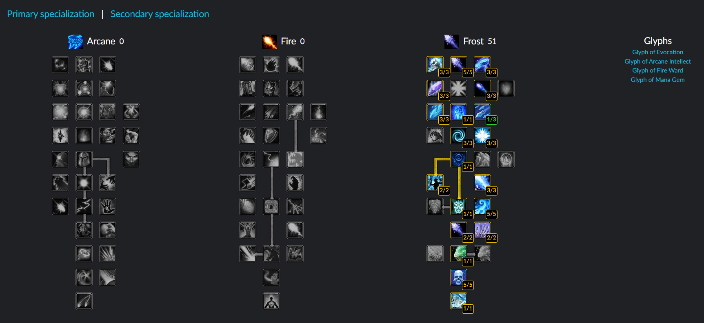
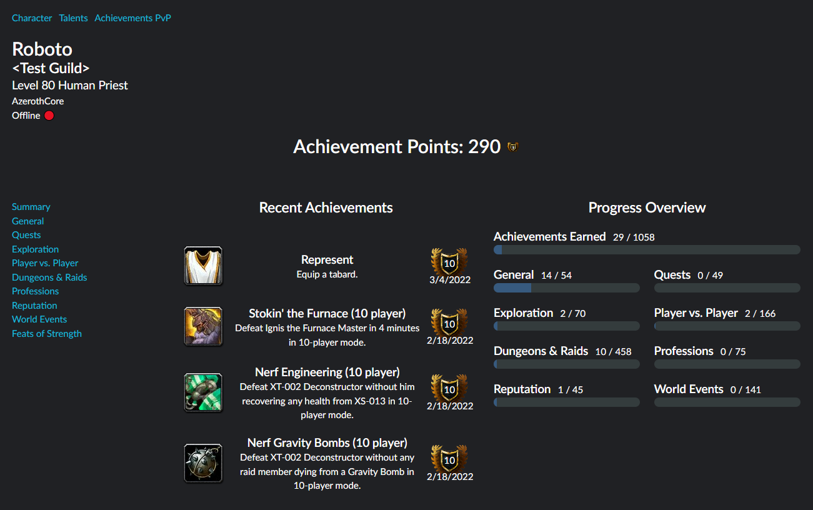
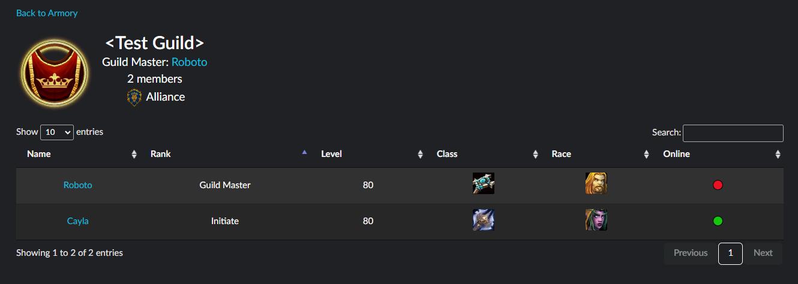

<!-- SHIELDS -->
[![Stargazers][stars-shield]][stars-url]
[![Forks][forks-shield]][forks-url]
[![Issues][issues-shield]][issues-url]
[![MIT License][license-shield]][license-url]


<!-- SUMMARY -->
<div align="center">
	<h1 align="center">AzerothCore Armory</h1>
	<p align="center">
		A website to view your <a href="https://github.com/azerothcore/azerothcore-wotlk">AzerothCore</a> server's characters
		<br />
		<a href="https://github.com/r-o-b-o-t-o/azerothcore-armory/issues/new?template=bug_report.yml">Report a Bug</a>
		·
		<a href="https://github.com/r-o-b-o-t-o/azerothcore-armory/issues/new?template=feature_request.yml">Request a Feature</a>
		·
		<a href="https://github.com/r-o-b-o-t-o/azerothcore-armory/issues/new?template=question.yml">Ask a Question</a>
	</p>
</div>


<!-- TABLE OF CONTENTS -->
<details>
	<summary>Table of Contents</summary>

<ol>
	<li>
		<a href="#about">About</a>
		<ul>
			<li><a href="#built-with">Built With</a></li>
		</ul>
	</li>
	<li>
		<a href="#getting-started">Getting Started</a>
		<ul>
			<li><a href="#prerequisites">Prerequisites</a></li>
			<li><a href="#installation">Installation</a></li>
			<li><a href="#configuration-reference">Configuration Reference</a></li>
		</ul>
	</li>
	<li>
		<a href="#usage">Usage</a>
		<ul>
			<li><a href="#with-docker">With Docker</a></li>
			<li><a href="#with-an-iframe">With an iframe</a></li>
			<li><a href="#demo">Demo</a></li>
		</ul>
	</li>
	<li><a href="#features">Features</a></li>
	<li><a href="#contributing">Contributing</a></li>
	<li><a href="#show-your-support">Show your Support</a></li>
	<li><a href="#license">License</a></li>
	<li><a href="#contact">Contact</a></li>
</ol>
</details>


<!-- ABOUT -->
## About

AzerothCore-Armory is a website that enables you to view your [AzerothCore][github-ac] server's characters and guilds.  
At the time I started working on this project (end of 2021), there were virtually no modern and public/open-source armory projects.  
I also noticed that such a tool was frequently requested in the AzerothCore Discord server, so I decided to make one. Hope you like it!

<details>
	<summary>View screenshots</summary>






</details>


### Built With

* [Node.js](https://nodejs.org/)
* [TypeScript](https://www.typescriptlang.org/)
* [Express JS](https://expressjs.com/)
* [Handlebars](https://handlebarsjs.com/)
* [JQuery](https://jquery.com/)
* [DataTables](https://datatables.net/)
* [Bulma](https://bulma.io/)

<p align="right">(<a href="#top">back to top</a>)</p>


<!-- GETTING STARTED -->
## Getting Started

### Prerequisites

* [Node.js](https://nodejs.org/en/download/)
* An [AzerothCore][github-ac]-based server database
* *(Optional)* [Docker](https://www.docker.com/get-started)

### Installation

1. Clone the repository:  
	* With HTTPS:
		```sh
		git clone https://github.com/r-o-b-o-t-o/azerothcore-armory.git
		```
		**OR**
	* With SSH:
		```sh
		git clone git@github.com:r-o-b-o-t-o/azerothcore-armory.git
		```
3. Install the dependencies:
	```sh
	cd azerothcore-armory/
	npm install
	```
4. Configure the application: copy `config.default.json` to `config.json` or `.env.example` to `.env` and edit the resulting file.  
	See the [Configuration Reference](#configuration-reference) below for a description of all values.
5. Download the model viewer's data:
	* Download from script:
		```sh
		npm run build
		npm run fetchdata
		```
		**OR**
	* Download the latest archive (`data.zip`) from the [Releases](https://github.com/r-o-b-o-t-o/azerothcore-armory/releases) page and extract it to the `data/` directory.

### Configuration Reference

<details>
	<summary>Main configuration</summary>

| config.json                    | .env                                               | Type                          | Default value                    | Description                                                                                                                                                                                            |
|--------------------------------|----------------------------------------------------|-------------------------------|----------------------------------|--------------------------------------------------------------------------------------------------------------------------------------------------------------------------------------------------------|
| `aowowUrl`                     | `ACORE_ARMORY_AOWOW_URL`                           | String                        | `"https://wotlkdb.com"`          | The URL of the AoWoW database to use for tooltips and links                                                                                                                                            |
| `websiteUrl`                   | `ACORE_ARMORY_WEBSITE_URL`                         | String                        | `"https://mywebsite.com"`        | Your website's URL. Used to redirect to the homepage on error pages                                                                                                                                    |
| `websiteName`                  | `ACORE_ARMORY_WEBSITE_NAME`                        | String                        | `"My Website"`                   | Your website's name. Displayed in the redirect button on error pages                                                                                                                                   |
| `websiteRoot`                  | `ACORE_ARMORY_WEBSITE_ROOT`                        | String                        | `""`                             | The root of your armory's URL. If your armory is hosted on, for example,   `http://mywebsite.com/azerothcore-armory`, the `websiteRoot` value should be   `"/azerothcore-armory"`                      |
| `iframeMode`                   | `ACORE_ARMORY_IFRAME_MODE__`...                    | Object                        |                                  | Settings for the iframe mode                                                                                                                                                                           |
| `iframeMode.enabled`           | `ACORE_ARMORY_IFRAME_MODE__ENABLED`                | Boolean                       | `false`                          | Set to `true` if you want to embed the armory in an iframe                                                                                                                                             |
| `iframeMode.url`               | `ACORE_ARMORY_IFRAME_MODE__URL`                    | String                        | `"https://mywebsite.com/armory"` | Set this to the URL of the page that hosts the `iframe`                                                                                                                                                |
| `loadDbcs`                     | `ACORE_ARMORY_LOAD_DBCS`                           | Boolean                       | `true`                           | Loads the DBC data from the `data` directory into memory when starting   up. It is highly recommended to set this to `true`. Only use `false` to keep   memory usage low, on a test server for example |
| `hideGameMasters`              | `ACORE_ARMORY_HIDE_GAME_MASTERS`                   | Boolean                       | `true`                           | Hides Game Master characters if set to `true`. They will not be found in   the search page, and their character pages will show a 404 error                                                            |
| `realms`                       | `ACORE_ARMORY_REALMS__`...                         | Array of objects              |                                  | An array of realm configurations                                                                                                                                                                       |
| `realms[0].name`               | `ACORE_ARMORY_REALMS__0__NAME`                     | String                        | `"AzerothCore"`                  | The name of the realm. Will be used in the URLs, shown on the character   pages and in the search page if you have multiple realms                                                                     |
| `realms[0].realmId`            | `ACORE_ARMORY_REALMS__0__REALM_ID`                 | Number                        | `1`                              | The realm's ID, this must match the `id` column of the `realmlist` table   in the auth database                                                                                                        |
| `realms[0].authDatabase`       | `ACORE_ARMORY_REALMS__0__AUTH_DATABASE`            | String                        | `"acore_auth"`                   | The name of the auth database                                                                                                                                                                          |
| `realms[0].charactersDatabase` | `ACORE_ARMORY_REALMS__0__CHARACTERS_DATABASE__`... | Database configuration object |                                  | Configuration for the characters database. See "Database   configuration" below                                                                                                                        |
| `worldDatabase`                | `ACORE_ARMORY_WORLD_DATABASE__`...                 | Database configuration object |                                  | Configuration for the world database. This is shared between all realms   at the moment. See "Database configuration" below                                                                            |
| `dbQueryTimeout`               | `ACORE_ARMORY_DB_QUERY_TIMEOUT`                    | Number                        | `10000`                          | The maximum duration in milliseconds of a database query before it times   out                                                                                                                         |
</details>

<details>
	<summary>Database configuration</summary>

| config.json | .env          | Type   | Default value | Description                                    |
|-------------|---------------|--------|---------------|------------------------------------------------|
| `host`      | ...`HOST`     | String | `"localhost"` | The hostname or IP address of the MySQL server |
| `port`      | ...`PORT`     | Number | `3306`        | The port that the MySQL server runs on         |
| `user`      | ...`USER`     | String | `acore`       | The MySQL user used to connect to the database |
| `password`  | ...`PASSWORD` | String | `acore`       | The password for the specified MySQL user      |
| `database`  | ...`DATABASE` | String |               | The name of the MySQL database                 |
</details>

<p align="right">(<a href="#top">back to top</a>)</p>


<!-- USAGE -->
## Usage

Build the application:
```sh
npm run build
```
Start the application:
```sh
npm start
```
Open a web browser and navigate to http://localhost:48733

Other useful npm scripts:
* `npm run clean`: cleans the build directory
* `npm run watch`: watches for changes and rebuilds automatically, useful for development
* `npm run fetchdata`: downloads the data needed by the 3d model viewer
* `npm run cleardata`: clears the data downloaded for the 3d model viewer

### With Docker

You can also use [Docker](https://www.docker.com/), simply use `docker-compose`:
```sh
cd azerothcore-armory/
docker-compose up -d
```
*Note: the Docker version supports only the `.env` file for configuration, not `config.json`*

### With an iframe

You might want to integrate the application directly into your existing website using an `iframe`.
1. Set `iframeMode`.`enabled` to `true` in your configuration.
2. Set `iframeMode`.`url` in your configuration to the URL in your website that the armory will be accessible from (the page hosting the `iframe`).
3. Embed the code snippet below into your page.  
Make sure you replace the URL `http://localhost:48733` with your Armory's URL (the same URL as `iframeMode`.`url`) at the end of the code snippet.
<details>
	<summary>Click to expand embed code</summary>

```html
<style>
	#armory-iframe {
		/*
		* Using min-width to set the width of the iFrame, works around an issue in iOS that can prevent the iFrame from sizing correctly.
		* See: https://github.com/davidjbradshaw/iframe-resizer
		*/
		width: 1px;
		min-width: 100%;

		border: none;
	}
</style>

<iframe id="armory-iframe"></iframe>

<script type="application/javascript" src="https://cdn.jsdelivr.net/npm/iframe-resizer@4.3.2/js/iframeResizer.min.js"></script>
<script type="application/javascript">
	let resizeSetup = false;
	window.addEventListener("message", (ev) => {
		if (ev.data.url !== undefined) {
			const url = ev.data.url.trim().replace(/^\//, "");
			window.history.replaceState(null, null, url === "" ? window.location.pathname : ("?" + url));
		} else if (ev.data === "contentLoaded") {
			if (!resizeSetup) {
				iFrameResize({ checkOrigin: false, autoResize: true }, "#armory-iframe");
				resizeSetup = true;
			} else {
				document.getElementById("armory-iframe").iFrameResizer.resize();
			}
		}
	});

	const iframe = document.getElementById("armory-iframe");
	const url = window.location.search.replace(/^\?/, "");
	iframe.src = "http://localhost:48733/" + url;
</script>
```
</details>


### Demo

This repository is used in production over at [ChromieCraft](https://www.chromiecraft.com/armory), check it out there!

<p align="right">(<a href="#top">back to top</a>)</p>


<!-- FEATURES -->
## Features

- [X] Characters list / search page
- [X] Character page
	- [X] Online/offline status
	- [X] Equipment with tooltips
	- [X] 3d model, including mounts
	- [X] Talent trees, including glyphs and dual spec support
	- [X] Achievements
	- [X] PvP statistics, including arena teams
	- [ ] Statistics (from the achievements panel in-game)
	- [ ] Reputations
	- [ ] Stats (from the character sheet, i.e. health, mana, etc)
- [X] Guild page
	- [X] Guild emblem
	- [X] Members list
	- [ ] PvE statistics
- [X] Multiple realms support
- [ ] PvE ladder
- [ ] PvP ladder

See the [open issues](https://github.com/r-o-b-o-t-o/azerothcore-armory/issues) for a list of suggested features and known issues.

<p align="right">(<a href="#top">back to top</a>)</p>


<!-- CONTRIBUTING -->
## Contributing

Any and all contributions are **greatly appreciated**.

If you have a suggestion that would make this project better, feel free to fork the repository and create a Pull Request. You can also open a [Feature Request][feature-request].

<p align="right">(<a href="#top">back to top</a>)</p>


<!-- SUPPORT -->
## Show your Support

⭐️ Give the project a star if you like it!

<a href="https://ko-fi.com/roboto" target="_blank">

<p align="right">(<a href="#top">back to top</a>)</p>


<!-- LICENSE -->
## License

Distributed under the MIT License. See the [`LICENSE`][license-url] file for more information.

<p align="right">(<a href="#top">back to top</a>)</p>


<!-- CONTACT -->
## Contact

 Feel free to get in touch with me on Discord: `Roboto#9185`

<p align="right">(<a href="#top">back to top</a>)</p>


<!-- MARKDOWN LINKS -->
<!-- https://www.markdownguide.org/basic-syntax/#reference-style-links -->
[github-ac]: https://github.com/azerothcore/azerothcore-wotlk
[stars-shield]: https://img.shields.io/github/stars/r-o-b-o-t-o/azerothcore-armory.svg?style=flat
[stars-url]: https://github.com/r-o-b-o-t-o/azerothcore-armory/stargazers
[forks-shield]: https://img.shields.io/github/forks/r-o-b-o-t-o/azerothcore-armory.svg?style=flat
[forks-url]: https://github.com/r-o-b-o-t-o/azerothcore-armory/network/members
[issues-shield]: https://img.shields.io/github/issues/r-o-b-o-t-o/azerothcore-armory.svg?style=flat
[issues-url]: https://github.com/r-o-b-o-t-o/azerothcore-armory/issues
[license-shield]: https://img.shields.io/github/license/r-o-b-o-t-o/azerothcore-armory.svg?style=flat
[license-url]: https://github.com/r-o-b-o-t-o/azerothcore-armory/blob/master/LICENSE
[feature-request]: https://github.com/r-o-b-o-t-o/azerothcore-armory/issues/new?template=feature_request.yml
